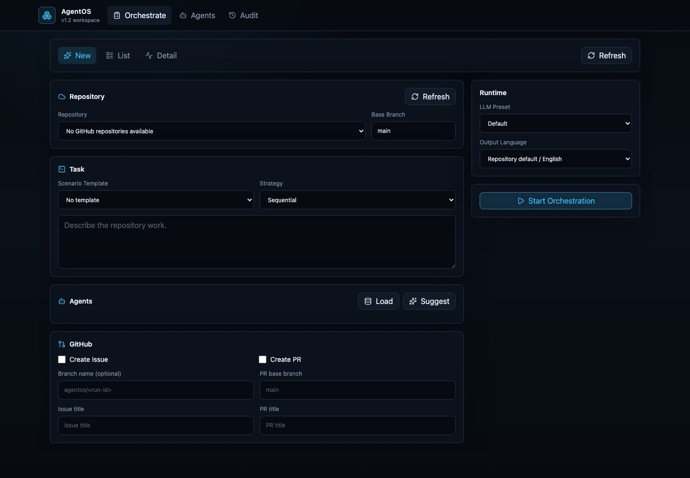

# AgentOS

[](https://github.com/kazyamaz200/agentos/actions/workflows/ci.yml)
[](https://go.dev/)
[](LICENSE)
[](https://goreportcard.com/report/github.com/kazyamaz200/agentos)
[](https://github.com/kazyamaz200/agentos/releases)
[](https://pkg.go.dev/github.com/kazyamaz200/agentos)

**A Go runtime for autonomous coding agents.**

> Define agents. Run agents. Scale agents.

*Write Agents by defining them, not by implementing them.*

AgentOS is not another coding agent — it is the operating system layer for autonomous coding agents. It provides a runtime, lifecycle, execution model, tool system, memory abstraction, and safety model. It uses [LiteLLM](https://github.com/BerriAI/litellm) as the LLM gateway, providing a unified interface to various LLM backends.

Designed for Kubernetes deployment. Manage runs, review diffs, and
search across agents through the [Web UI](docs/api.md).



```bash
helm repo add agentos https://kazyamaz200.github.io/agentos
helm install agentos agentos/agentos \
  --set env.LITELLM_BASE_URL=http://litellm:4000
```

## Features

- **Task Planning** — LLM generates structured execution plans from task descriptions
- **Tool Execution** — Read, write, search, shell, git, and test tools
- **Review & Retry** — Automated code review with retry on test/lint failure
- **GitHub Automation** — Issue-triggered runs, PR creation, source issue comments, close policies, and approval gates
- **GitHub App Tokens** — Installation-token support for repository write operations
- **Specialized Built-In Agents** — Backend, frontend, CI, docs, security, release, dependency, QA, Docker, Helm, Kubernetes, DevOps, analyst, reporter, and review workflows
- **Repository Agents** — Load safe custom agent profiles from `.agentos/agents/*.yaml`
- **Scenario Templates** — Apply built-in and repository `.agentos/scenarios/*.yaml` orchestration templates
- **Vector Search** — Local (JSON) or Qdrant vector store for semantic search
- **Agent Memory** — Persistent memory with vector-based retrieval
- **Repository Memory** — Approved repository-scoped lessons reused during planning
- **Coding Guidelines** — YAML-defined guidelines with semantic search
- **Repository Guidelines** — Branch-scoped rules loaded from repository files or the Web UI
- **Past PR Search** — Search across previous runs and PRs
- **MCP Integration** — Connect to MCP servers for external tools
- **Sandbox Interface** — Local execution today, Docker backend planned
- **Web UI** — React/Tailwind dashboard for orchestration, agents, audit, GitHub, memory, guidelines, and repository context search
- **Agent Factory** — Create agents dynamically from profile templates
- **Multi-Agent Orchestration** — Coordinate multiple agents on complex tasks
- **Quality Gates** — Validate expected outputs, tests, lint, diffs, and generated artifacts before completion
- **Safety First** — Command denylist, secret redaction, RBAC, audit logs, and main branch protection
- **Full Audit Trail** — All LLM calls, tool executions, and artifacts saved per run
- **Extensible** — Interface-based design for tools, LLM clients, and agents

## Requirements

- Go 1.22+
- [LiteLLM](https://github.com/BerriAI/litellm) proxy running and accessible

## Installation

```bash
git clone https://github.com/kazyamaz200/agentos.git
cd agentos
go build -o agentos ./cmd/agentos
```

## Setup

### 1. Start LiteLLM

```bash
pip install litellm
litellm --model ollama/codellama --port 4000
# Or any OpenAI-compatible model
```

### 2. Set Environment Variables

```bash
export LITELLM_BASE_URL=http://localhost:4000
export LITELLM_API_KEY=sk-local
export AGENTOS_MODEL_CODER=coder
```

## Quick Start

See the [Quick Start Guide](docs/quickstart.md) for a step-by-step walkthrough.

### CLI Reference

```bash
# Deploy on Kubernetes
helm install agentos agentos/agentos \
  --set env.LITELLM_BASE_URL=http://litellm:4000

# Run a coding task
agentos run --task task.yaml --profile profiles/go_backend.yaml

# Run using a definition file (v1.0 format)
agentos run --task task.yaml --definition definitions/go-backend.yaml

# Start Web UI (local dev)
agentos serve --port 8080

# List registered agents
agentos agent list

# Multi-agent orchestration
agentos orchestrate \
  --agents "go-backend,reviewer,docs" \
  --strategy parallel \
  --repo . \
  --task "Implement user auth, tests, and documentation"

# Start an issue-sourced orchestration from the Web/API
# Supports close policies such as never, on_quality_gate_pass,
# on_pr_merge, and after_human_approval.

# Shell completion
agentos completion zsh

# GitHub operations
agentos issue list --repo owner/repo

# View version
agentos version
```

## Task YAML

```yaml
id: "task-001"
type: "issue_to_patch"
repo: "./my-repo"
base_branch: "main"
branch: "agent/task-001"
title: "Add input validation to API"
description: |
  Add input validation to the users API.
  Do not break existing tests.
```

## Profile YAML

```yaml
name: "go-backend-agent"
role: "Go backend coding agent"

llm:
  provider: "litellm"
  model: "coder"
  temperature: 0.2
  max_tokens: 8192

tools:
  allow:
    - read_file
    - write_file
    - search
    - shell
    - git
    - test
  deny_commands:
    - "rm -rf"
    - "sudo"
    - "curl"

commands:
  test: "go test ./..."
  lint: "go vet ./..."

limits:
  max_iterations: 8
  max_retries: 3
  max_changed_files: 20
  max_runtime_minutes: 30
```

## Run Artifacts

Each run saves to `${AGENTOS_HOME}/runs/{task_id}/`. If `AGENTOS_HOME` is not set, AgentOS uses `~/.agentos`.

```
task.yaml         # Original task
profile.yaml      # Original profile
plan.json         # LLM-generated plan
tool_log.jsonl    # All tool executions
llm_log.jsonl     # All LLM API calls
test.log          # Test output
lint.log          # Lint output
diff.patch        # Git diff of changes
summary.md        # Run summary
pr_body.md        # Pull request body draft
```

## Safety

- **Command denylist**: `rm -rf`, `sudo`, `curl`, `wget`, `ssh`, `scp` are denied by default
- **Secret detection**: `.env`, `*.pem`, `id_rsa*`, `id_ed25519*` are blocked by filesystem tools
- **Branch handling**: Runs create and work on the task branch when possible
- **File limits**: Maximum changed file limits are defined in profiles and planned for enforcement
- **Retry limits**: Automatic retry with configurable maximum

## Documentation

- [Quick Start](docs/quickstart.md) — Get up and running in 5 minutes
- [Deployment](docs/deployment.md) — Kubernetes deployment via Helm
- [Pre-merge Verification](docs/pre-merge-verification.md) — PR image checks with registry and BuildKit
- [Architecture](docs/architecture.md) — System architecture overview
- [Configuration](docs/configuration.md) — LiteLLM, Qdrant, Docker, MCP, templates
- [Upgrade to v1.3](docs/upgrade-v1.3.md) — Scheduled operations, reporting, notifications, and ops agents
- [Profiles](docs/profiles.md) — Profile YAML schema reference
- [Agent Definitions](docs/agent-definitions.md) — Versioned Agent YAML format (agentos.io/v1)
- [Repository Agents](docs/repository-agents.md) — Custom `.agentos/agents/*.yaml` profiles for target repositories
- [Scenario Templates](docs/scenario-templates.md) — Reusable Orchestrate templates and repository `.agentos/scenarios/*.yaml`
- [Safety](docs/safety.md) — Safety mechanisms and command policies
- [Event Bus](docs/event-bus.md) — Structured events for observability
- [Factory](docs/factory.md) — Creating agents from definitions
- [Memory](docs/memory.md) — Pluggable memory backends (vector, JSON)
- [Sandbox](docs/sandbox.md) — Execution isolation (local, Docker)
- [Orchestrator](docs/orchestrator.md) — Multi-agent coordination
- [Embedding](docs/embedding.md) — LLM embedding service
- [Search](docs/search.md) — Unified search across sources
- [Guidelines](docs/guidelines.md) — Coding guidelines management
- [MCP](docs/mcp.md) — Model Context Protocol integration
- [API](docs/api.md) — REST API reference for web UI
- [React Web UI Migration](docs/webui-react-tailwind-migration.md) — Web UI implementation notes

## Environment Variables

| Variable | Default | Description |
|----------|---------|-------------|
| `LITELLM_BASE_URL` | `http://localhost:4000` | LiteLLM proxy URL |
| `LITELLM_API_KEY` | `sk-local` | API key for LiteLLM |
| `AGENTOS_MODEL_CODER` | `coder` | Model for coding tasks |
| `AGENTOS_HOME` | `~/.agentos` | State directory for run artifacts and local vector indexes |
| `GITHUB_TOKEN` | - | GitHub personal access token for API operations |
| `GH_TOKEN` | - | Alternative GitHub token (fallback) |
| `AGENTOS_MODEL_EMBEDDING` | `text-embedding-ada-002` | Model for embeddings |
| `QDRANT_URL` | `http://localhost:6333` | Qdrant vector database URL |
| `QDRANT_API_KEY` | - | Qdrant API key |
| `AGENTOS_AUTH_REQUIRED` | `false` | Require GitHub login for work-triggering APIs |
| `AGENTOS_ORCHESTRATE_SUBTASK_TIMEOUT` | `10m` | Timeout for each orchestration subtask |
| `GITHUB_OAUTH_CLIENT_ID` | - | GitHub OAuth App client ID |
| `GITHUB_OAUTH_CLIENT_SECRET` | - | GitHub OAuth App client secret |
| `GITHUB_OAUTH_CALLBACK_URL` | - | GitHub OAuth callback URL |

## Release Notes

The Helm chart workflow skips already published chart versions. Before a
release that changes `charts/agentos/**`, update both `version` and
`appVersion` in `charts/agentos/Chart.yaml` intentionally so chart-releaser can
publish a new immutable chart release.

## Roadmap

### v1.4 — Governance Scale & Evals
- [ ] Governance execution limits, quotas, and cost controls
- [ ] Storage retention, archival, and cleanup policies
- [ ] Orchestration regression and scenario evaluation suite

### v1.3 — Scheduled Operations & Reporting
- [x] Built-in Docker, Helm, and Kubernetes operations agents
- [x] Analyst and reporter agents for investigation workflows
- [x] Log and data sources for investigation agents
- [x] Recurring orchestration jobs
- [x] Built-in maintenance and reporting workflow templates
- [x] Outcome notifications for scheduled orchestrations

### Previous Release — Agent Expansion & Repository Context
- [x] Expanded built-in agent registry for broader repository workflows
- [x] Convention-aware built-in agent guidance and specialist routing
- [x] Repository-defined custom agent profiles
- [x] Reusable built-in and repository scenario templates
- [x] Built-in frontend application agent
- [x] Repository-scoped continuous improvement memory
- [x] Repository-specific guideline management and retrieval
- [x] Repository-scoped context discovery UX
- [x] React and Tailwind CSS Web UI migration

### v1.1 — GitHub Automation & Run UX
- [x] GitHub App installation tokens for repository write operations
- [x] Issue-triggered orchestration and source issue comments
- [x] Pull request creation from orchestration records
- [x] Close policies, quality gates, and human approval controls
- [x] RBAC checks, audit logging, and centralized secret redaction
- [x] Live orchestration progress, timeline, cancellation, and recommendations

### Earlier Foundations
- [x] Runtime Agent interface, standardized tools, lifecycle hooks, and retry/review loop
- [x] Built-in agent registry, versioned Agent Definition schema, profiles, and Agent Factory
- [x] Multi-agent orchestration with sequential and parallel execution
- [x] Event bus, run persistence, audit-ready artifacts, and JSONL logs
- [x] Local sandbox interface with Docker backend extension point
- [x] Vector search, embeddings, memory, guidelines, and unified search
- [x] GitHub issue, PR, CI checks, and CI-fix workflows
- [x] MCP client and tool adapter integration
- [x] Helm chart and Web UI foundation
- [x] Task YAML loading
- [x] Profile YAML loading
- [x] LLM-based planning
- [x] Tool execution (file, search, shell, git, test)
- [x] Test/lint with retry
- [x] Run artifact persistence
- [x] Safety policies

## License

Apache-2.0
